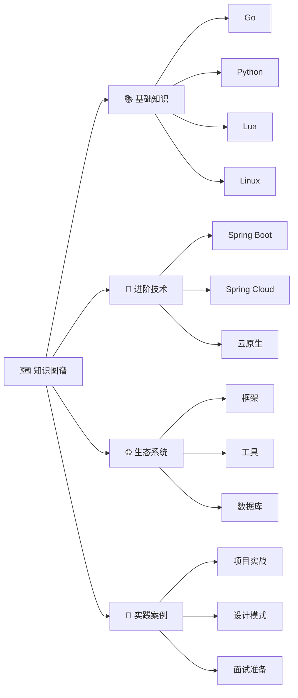

# 🎯 lbb4511 技术知识图谱

欢迎来到我的技术学习知识图谱！这里系统地整理了从编程基础到架构设计的完整学习路径。

## 🗺️ 知识图谱导航

## 📊 内容统计

| 分类 | 文档数 | 状态 |
|------|--------|------|
| 基础知识 | 4+ | 🟢 活跃 |
| 进阶技术 | 2+ | 🟢 活跃 |
| 生态系统 | 1+ | 🟡 建设中 |
| 实践案例 | 1+ | 🟡 建设中 |

## 🎯 学习路径推荐

### 🔰 后端开发路线
1. [Go语言基础](./go/) → [Spring Boot](./spring-boot/) → [微服务架构](./advanced/microservices/)
2. [Python基础](./python/) → [Web框架](./ecosystem/frameworks/) → [项目实战](./practices/)

### 🔧 DevOps路线
1. [Linux基础](./linux/) → [Shell脚本](./basics/os/shell.md) → [Docker容器](./advanced/cloud-native/docker.md)
2. [Kubernetes编排](./advanced/cloud-native/k8s.md) → [CI/CD流水线](./advanced/devops/cicd.md)

### ☁️ 云原生架构师路线
1. [微服务基础](./advanced/microservices/) → [Spring Cloud](./spring-cloud/) → [容器化](./advanced/cloud-native/docker.md)
2. [Kubernetes](./advanced/cloud-native/k8s.md) → [服务网格](./advanced/cloud-native/service-mesh.md)

## 🔗 快速导航

- [🗺️ 知识图谱全貌](./knowledge-graph.md) - 查看完整技术图谱
- [🔗 技术关联映射](./tech-map.md) - 了解技术依赖关系
- [🏷️ 标签索引](./tags.md) - 按标签查找内容

## 📝 最近更新

- 重构知识图谱架构
- 添加 Spring Boot / Spring Cloud 学习笔记
- 建立技术关联映射
- 创建学习路径推荐

## 🤝 参与贡献

如果发现错误或有好的建议，欢迎提交 Issue 或 PR。

---

💡 **提示**: 使用顶部导航栏或左侧目录快速切换内容
