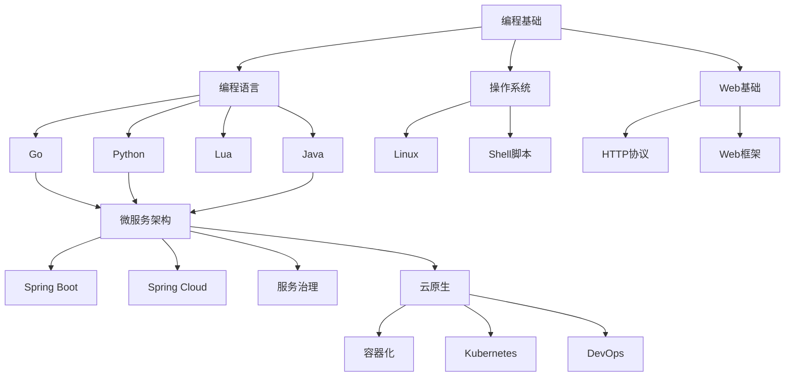

# 🗺️ 知识图谱

本知识图谱按照学习路径和技术关联组织内容。

## 📊 图谱概览

## 🎯 学习路径

### 路径一：后端开发工程师
1. [编程语言基础](./basics/programming-languages/)
2. [操作系统与Linux](./basics/os/)
3. [Web开发基础](./basics/web/)
4. [微服务架构](./advanced/microservices/)
5. [云原生技术](./advanced/cloud-native/)

### 路径二：DevOps工程师
1. [Linux系统管理](./basics/os/linux.md)
2. [Shell脚本编程](./basics/os/shell.md)
3. [容器技术](./advanced/cloud-native/docker.md)
4. [Kubernetes](./advanced/cloud-native/k8s.md)
5. [CI/CD实践](./advanced/devops/cicd.md)

### 路径三：全栈开发者
1. [Python全栈](./basics/programming-languages/python/)
2. [Web框架](./ecosystem/frameworks/)
3. [数据库](./ecosystem/databases/)
4. [前端基础](./basics/web/frontend.md)
5. [项目实战](./practices/projects/)

## 🏷️ 技术标签

### 按难度分类
- 🟢 入门
- 🟡 进阶
- 🔴 高级

### 按类型分类
- 📚 理论
- 💻 实践
- 🛠️ 工具
